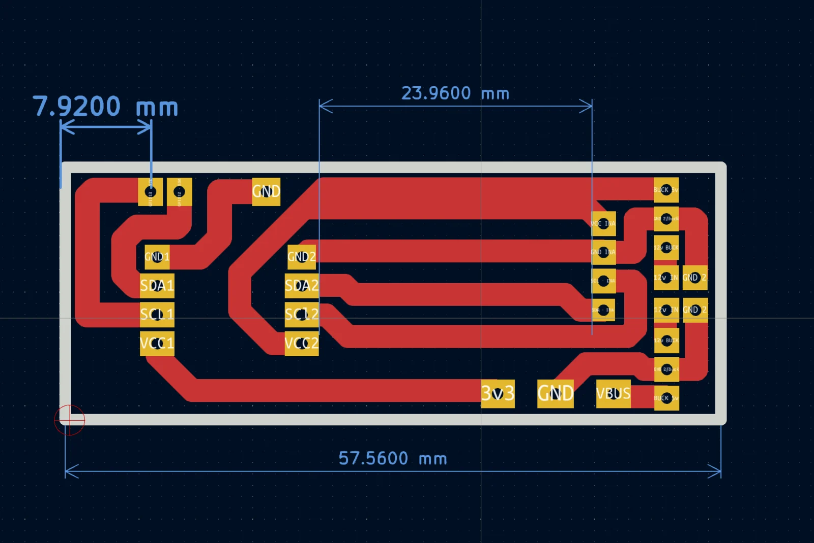

# W5500-EVB-Pico Piggyback PCB

This directory contains the current top-level piggyback board imported from the
original `pico w5500s` KiCad design folder.

## Contents

- `source/w5500.kicad_pcb`: editable PCB layout
- `source/w5500.kicad_pro`: KiCad project configuration
- `fabrication/gerber/`: supplied front-copper, edge, drill and job files
- `fabrication/cnc/`: supplied isolation-routing, edge-cut and drill CNC files

No matching schematic file was present for this board. Older version folders,
automatic backups, FlatCAM project state, KiCad local preferences, caches and
macOS metadata were intentionally not imported.

The supplied fabrication files were generated separately from the editable
source and may not represent its newest saved state. Before fabrication, open
the PCB in KiCad, run DRC, verify the approximately `57.56 mm` board length,
connector pitch/orientation and all clearances, then regenerate the required
Gerber/drill or CNC files.

The board attaches to the W5500-EVB-Pico with female header strips. Confirm the
header alignment and orientation before applying power.
